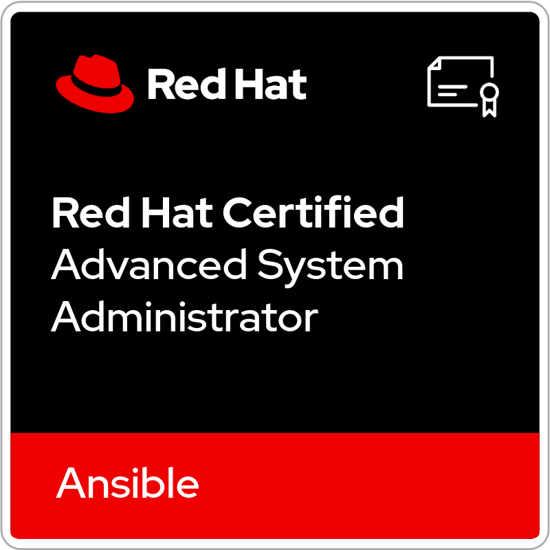

<!-- Yata-Datacom · GitHub Profile · nord 配色 -->

### 你好，我是 Yata 👋

**网络运维 × 自动化工具** ｜ 华为 VRP · 新华三 · 锐捷 ｜ Python / Rust · 云原生

---

## 🏅 认证与徽章

<!-- credly-badges:start -->

<!-- credly-badges:end -->

---

## 🧰 工具箱

| 项目 | 一句话说明 | 技术栈 |
| :-- | :-- | :-- |
| **[Network Inspection Tool · GUI Edition](https://github.com/Yata-Datacom/Network-Device-Server-Inspection-Tool-GUI-Edition)** | 网络设备 / Linux 服务器自动巡检：异常检测、配置备份、报告导出、连接配置管理 | `Python` `SSH` `GUI` |
| **[NADT — Network Automation Deployment Tool](https://github.com/Yata-Datacom/NADT-Network-Automation-Deployment-Tool)** | 🚧 预览版：厂商无关的交换机批量**零接触开局**（DHCP option 66/67 + TFTP），宏工作簿驱动 | `Python` `asyncio` `TFTP` `SQLite` |
| **[Traffic Load Tester](https://github.com/Yata-Datacom/Traffic-Load-Tester---Gateway-Stress-Tool)** | 网关 / 服务器高并发流量压测，TCP + UDP，实时 PPS 与带宽监控 | `Python` `Sockets` `GUI` |

> 三个项目都配了 `pytest` 测试套件 + GitHub Actions（多平台测试、代码风格检查、Windows 打包产物）。

---

## 🎯 关注方向

<table>
<thead>
<tr>
<th width="45%" align="left">方向</th>
<th width="55%" align="left">关注内容</th>
</tr>
</thead>
<tbody>
<tr><td><b>语言与工具</b></td><td>    </td></tr>
<tr><td><b>云原生</b></td><td>    </td></tr>
<tr><td><b>网络工程</b></td><td>     </td></tr>
</tbody>
</table>

---

## 💡 做事方式

- 🔧 **把重复劳动变成工具** —— 手工敲第 3 遍的活，就该有个界面和一键导出
- 🧪 **测试兜底** —— 先写用例锁住现状，再动刀；每个修好的缺陷都转成回归断言
- 🔌 **厂商无关优先** —— 能用标准协议（SSH / DHCP / TFTP / SNMP）就不绑私有字段
- 📦 **交付要自包含** —— 一个 exe、一份 README、一张校验表，别人拿到就能跑

---

⭐ 如果哪个小工具帮到了你，给个 Star 就行

