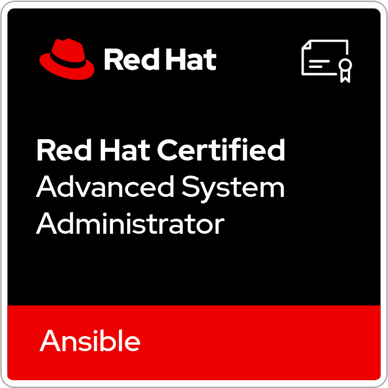
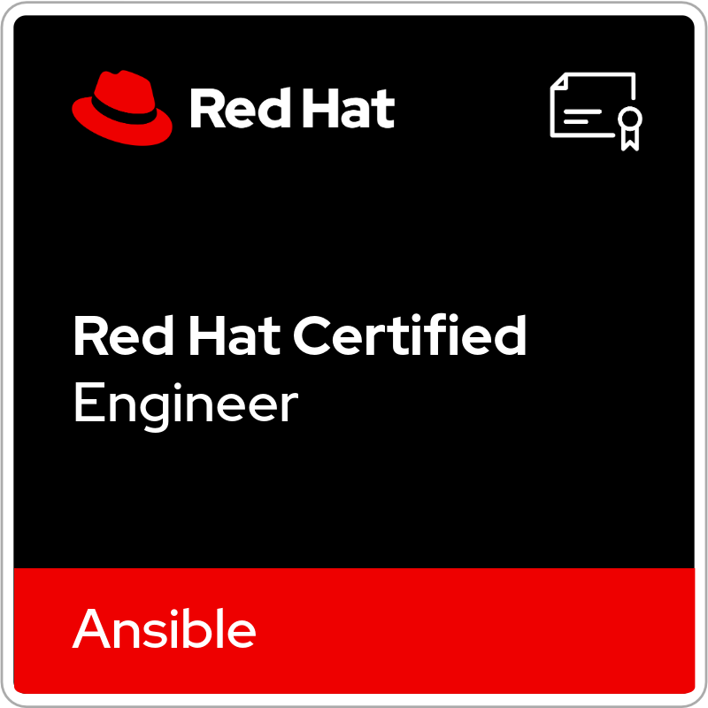
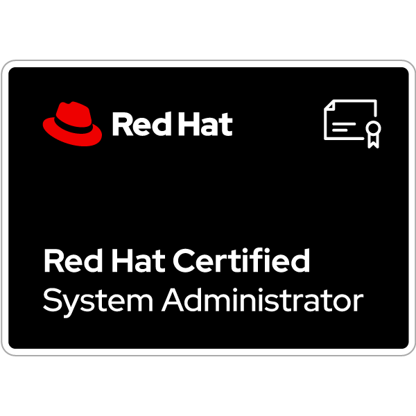

<!-- Yata-Datacom · GitHub Profile · nord 配色 · 中文页（英文页：README.md） -->

<picture>
  <source media="(prefers-color-scheme: dark)" srcset="./assets/banner.svg">
  <source media="(prefers-color-scheme: light)" srcset="./assets/banner-light.svg">
  
</picture>

  

<picture>
  <source media="(prefers-color-scheme: dark)" srcset="https://readme-typing-svg.demolab.com?font=Fira+Code&weight=600&size=22&pause=1200&color=88C0D0&center=true&vCenter=true&width=640&lines=Networks+%C2%B7+Automation+%C2%B7+Embedded;Cloud+Native+%C2%B7+and+what%27s+next;Turning+ideas+into+tools">
  <source media="(prefers-color-scheme: light)" srcset="https://readme-typing-svg.demolab.com?font=Fira+Code&weight=600&size=22&pause=1200&color=5E81AC&center=true&vCenter=true&width=640&lines=Networks+%C2%B7+Automation+%C2%B7+Embedded;Cloud+Native+%C2%B7+and+what%27s+next;Turning+ideas+into+tools">
  
</picture>

### 你好，我是 Yata 👋

**网络、系统、嵌入式，手边有什么硬件就折腾什么。**

[**English**](README.md) · [**简体中文**](README.zh-CN.md)

 

 

## 🧰 工具箱

| 项目 | 一句话说明 | 技术栈 |
| :-- | :-- | :-- |
| **[网络设备巡检工具 · GUI 版](https://github.com/Yata-Datacom/Network-Device-Server-Inspection-Tool-GUI-Edition)** | 网络设备 / Linux 服务器自动巡检：异常检测、配置备份、报告导出、连接配置管理。 | `Python` `SSH` `GUI` |
| **[NADT — 网络自动化交付工具](https://github.com/Yata-Datacom/NADT-Network-Automation-Deployment-Tool)** | 🚧 预览版 —— 厂商无关的交换机批量**零接触开局**（DHCP option 66/67 + TFTP），宏工作簿驱动。 | `Python` `asyncio` `TFTP` `SQLite` |
| **[流量负载测试器 — 网关压测工具](https://github.com/Yata-Datacom/Traffic-Load-Tester---Gateway-Stress-Tool)** | 网关 / 服务器高并发流量压测，TCP + UDP，实时 PPS 与带宽监控。 | `Python` `Sockets` `GUI` |
| **[DSH 便携版 · DeepSeek Harness 启动器](https://github.com/Yata-Datacom/DeepSeekHarness-Portable)** | DeepSeek Harness 绿色便携启动器：解压即用；启动前环境预检、冲突默认拒装、一键干净卸载、绝不打包密钥。 | `PowerShell` `WinForms` `Node.js` |

> 三个巡检 / 自动化工具都配了 `pytest` 测试套件 + GitHub Actions（多平台测试、代码风格检查、Windows 打包产物）；便携启动器自带环境隔离验证脚本。

## 🏅 认证与徽章

<!-- credly-badges:start -->

<!-- credly-badges:end -->

## 🎯 兴趣与下一步

| 方向 | 在弄什么 |
| :-- | :-- |
| **网络与协议** | SSH · DHCP / ZTP · TFTP · SNMP · 路由交换 · **SDN** |
| **自动化与工具** | Python · Rust · PowerShell · pytest · GitHub Actions |
| **嵌入式与硬件** | 小主板 / 迷你电脑上的 Linux · 单片机 · **SDR** |
| **云原生与底层** | Docker / Podman · Kubernetes · **eBPF** 与可观测性 |
| **最近在折腾** | 清单一直在变长 —— 只要跑得动代码，大概都有意思 |

## 💡 做事方式

- 🔧 **把重复劳动变成工具** —— 手工敲第 3 遍的活，就该有个界面和一键导出。
- 🧪 **测试兜底** —— 先写用例锁住现状，再动刀；每个修好的缺陷都转成回归断言。
- 🔌 **标准优先，别被绑死** —— 能用开放协议和普通格式，就不选把你锁在一家的东西。
- 📦 **交付要自包含** —— 一个 exe、一份 README、一张校验表，别人拿到就能跑。

⭐ 哪个小工具帮到你了，给个 Star 就行。

